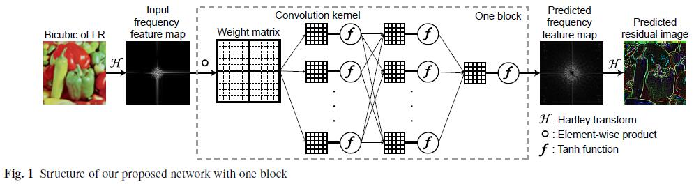
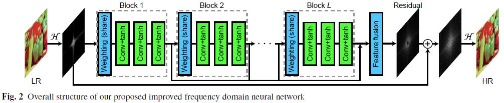
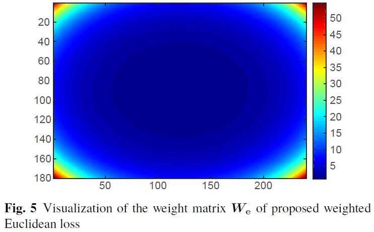

# IFNNSR (Caffe)

This is the implementation of paper "Xue, S., et al., Faster Image Super-Resolution by Improved Frequency Domain Neural Networks. Signal, Image and Video Processing, submitted, 2019."

## Environment

- OS: CentOS 7 Linux kernel 3.10.0-514.el7.x86_64
- CPU: Intel Xeon(R) CPU E5-2667 v4 @ 3.20GHz x 32
- Memory: 251.4 GB
- GPU: NVIDIA Tesla P4, 8 GB

## Software
- Cuda 8.0 (Cudnn installed)
- Caffe (pycaffe and matcaffe interface required)
- Python 2.7.5
- Matlab 2017b

## Dataset
These datasets are the same as other paper provided. Readers can directly use them or download them from here:

[BSDS100](https://drive.google.com/open?id=13yF988p3SfFEFsBxe6fqbmm7pHaCAndY), 
[BSDS200](https://drive.google.com/open?id=1DH-LWAtmoTC58STZ6wnp-wiNJdtn__D8), 
[General-100](https://drive.google.com/open?id=1ZZbVnycyu6rG3_Lfd4zEqyFTSGYeWIru), 
[Set5](https://drive.google.com/open?id=1VqTnAaMOwaHwlUtf1-JodObHJx5efLAC), 
[Set14](https://drive.google.com/open?id=17iz-E2m-9DuXRs7JnP6BUKUdCa_L1B-e), 
[T91](https://drive.google.com/open?id=1Q_7dDC6tfzzlygcmo_nSWEH_s8VMysdT), 
[Train_291](https://drive.google.com/open?id=1diz4wIG722KKwb9U3TLxHSKJ4oI2PclV), 
[Urban100](https://drive.google.com/open?id=1xjD8Rj_8werEkNQuXKdNcrF9VWz6wp7l), and 
[DIV2K](https://data.vision.ee.ethz.ch/cvl/DIV2K/).

## Train

1. Copy the 'train' directory to '.../Caffe_ROOT/examples/', and rename the directory to 'IFNNSR'.
2. Prepare datasets into your own directory.
3. (optional) run 'data_aug.m' in Matlab for data augmentation; e.g., data_aug('data/BSDS200'), which will generates a new directory 'BSDS-200-aug'.
4. Run 'generate_train_data.m' and 'generate_test_data.m' in Matlab to generate 'train_IFNNSR_x[2,3,4].h5' and 'test_IFNNSR_x[2,3,4].h5'. (modify the data path in *.m files)
5. (optional) Modify the parameters in 'create_IFNNSR_x[2,3,4].py'. 
6. Run in command line: 'python create_IFNNSR_[2,3,4].py'. It will regenerate 'train_x[2,3,4].prototxt' and 'test_x[2,3,4].prototxt'.
7. (optional) modify the parametes in 'solver_x[2,3,4].prototxt'.
8. Run in command line './examples/IFNNSR/run_train_x[2,3,4].sh' at 'Caffe_ROOT' path.
9. Waiting for the training procedure completed.

## Parameters for training (saved in solver_x2.prototxt)
- net: "examples/IFNNSR/train_x2.prototxt"
- test_iter: 1000
- test_interval: 100
- base_lr: 1e-4
- lr_policy: "step"
- gamma: 0.5
- stepsize: 10000
- momentum: 0.9
- weight_decay: 1e-04
- display: 100
- max_iter: 100000
- snapshot: 5000
- snapshot_prefix: 'examples/IFNNSR/model/x2/x2_d_c_k_'
- solver_mode: GPU
- type: "SGD"

## Test

1. Prepare datasets into 'data' directory.
2. Copy 'test_x[2,3,4].prototxt' from training directory to 'test' directory.
3. Copy '\*.caffemodel' from training directory to 'test/model' directory.
4. Modify some paths in 'test_IFNNSR_main.m' if necessary.
5. Run 'test_IFNNSR_main.m' in Matlab.
6. Metrics will be printed and reconstrcuted images will be saved into 'result' directory.

## Network architecture

**Readers can use 'Netscope' to visualize the network architecture**

## Custom Caffe layer: ElementWiseProduct

We define a new layer named "ElementWiseProduct" in Caffe, which implements the elementwise product opreation to data with a weight matrix:

input: $X \in \mathbb{R}^{n \times c \times h \times w}$, weight: $W \in \mathbb{R}^{1 \times 1 \times h \times w}$, and output $Y \in \mathbb{R}^{n \times c \times h \times w}$.
$$ Y_{ij} = W \circ X_{ij}, \ i = 1,2,\ldots,n, \ j = 1, 2, \ldots, c,$$
where $\circ$ is the Hadamard product (i.e., elementwise product) and $W$ contains parameters that can be learned during training. 
**Caffe files:** 
- /caffe/include/caffe/layers/elementwise_product_layer.hpp
- /caffe/src/caffe/layers/elementwise_product_layer.cpp
- /caffe/src/caffe/layers/elementwise_product_layer.cu

Place the three files above to corresponding positions of your own caffe directory. **Do not forget** to add a few definitions into '.../caffe/src/caffe/proto/caffe.proto' file. Detailed steps are provided in 'warning do NOT replace.txt' in our directory along with 'caffe.proto'.

## Custom Caffe layer: Weighted Euclidean loss
We propose the weighted Euclidean loss, which assigns larger values of weights to high-frequency parts and smaller values of
weights to low-frequency parts. Precisely, the loss function is defined as
\begin{align}
	{W}_{\rm e} &=
	\begin{bmatrix}
	w_{11} & w_{12} & \cdots & w_{1n} \\
	w_{21} & w_{22} & \cdots & w_{2n} \\
	\vdots & \vdots & \ddots & \vdots \\
	w_{m1} & w_{m2} & \cdots & w_{mn}
	\end{bmatrix} \in \mathbb{R}^{m \times n},  \\
	w_{ij} &= \exp\left ( \alpha \left (\frac{|m/2-i|}{m/2} \right )^2 + \beta \left (\frac{|n/2-j|}{n/2} \right )^2 \right ), \nonumber \\
	i &= 1,2,\ldots,m, \ \ j = 1,2,\ldots,n, \\
	e &= \frac{1}{2} \| {W}_{\rm e} \circ (\hat{I}_{\rm out} - \hat{I}_{\rm HR})\|_{\rm F}^2,
\end{align}
where $\alpha$ and $\beta$ are constants, ${W}_{\rm e}$ is the weight matrix, $\hat{I}_{\rm out}$ is the output of our network, $\hat{I}_{\rm HR}$ is the corresponding label, and $\|\cdot\|_{\rm F}$ denotes the Frobenius norm. 
**Caffe files:** 
- /caffe/include/caffe/layers/weight_l2_loss_layer.hpp
- /caffe/src/caffe/layers/weight_l2_loss_layer.cpp
- /caffe/src/caffe/layers/weight_l2_loss_layer.cu

If you have any suggestion or question, please do not hesitate to contact me.

## Contact 

Ph.D. candidate, Shengke Xue

College of Information Science and Electronic Engineering

Zhejiang University, Hangzhou, P.R. China

Email: xueshengke@zju.edu.cn, xueshengke1993@gmail.com
